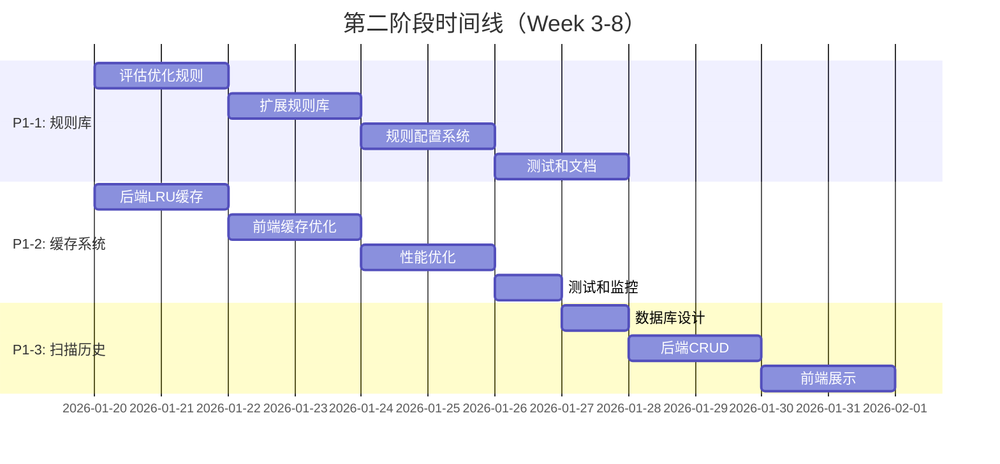

# 🚀 Skills Manager - 第二阶段开发计划

**文档版本**: 2.1
**创建日期**: 2026-01-14
**最后更新**: 2026-01-14
**基于**: 第一阶段已完成（PR #3 + #4）

> **📊 实际进度报告**: 详见 [PHASE2_PROGRESS_REPORT.md](./PHASE2_PROGRESS_REPORT.md)
>
> **当前状态** (2026-01-14):
> - ✅ P1-1: **85% 完成** (68/80条规则，缺12条)
> - 🟡 P1-2: **60% 完成** (后端完成，前端未开始)
> - ⚪ P1-3: **0% 完成** (未开始)
>
> **总体进度**: **48.3%** (P1 任务)

---

## 📊 第一阶段回顾（✅ 已完成）

### 交付成果
- ✅ **安全扫描引擎**: 60+ 规则、硬触发阻止、安全评分
- ✅ **UI/UX 改进**: Sonner Toast、骨架屏加载
- ✅ **用户文档**: 详细安全说明、免责声明、使用建议
- ✅ **安装前警告**: 双语确认对话框

### 技术指标
| 指标 | 数值 |
|------|------|
| 新增代码 | 2,200+ 行 |
| 新增文件 | 8 个 |
| 测试覆盖 | 13/13 ✅ |
| PR 合并 | 4 个 |
| 开发时间 | 1 天 |

---

## 🎯 第二阶段目标（Week 3-8）

**核心目标**: 建立完整的安全和评分系统
**里程碑**: v2.0.0 版本发布
**团队规模**: 4-5 人（后端×2 + 前端×1 + AI×1 + QA×1）

---

## 📋 任务优先级矩阵

| 优先级 | 任务类型 | 工作量 | 影响范围 | 紧急程度 | 建议开始 |
|--------|---------|--------|---------|---------|---------|
| 🔴 P1 | 完整安全规则库 | 3-5 天 | 安全 | 高 | Week 3 |
| 🟡 P1 | 智能缓存系统 | 3-5 天 | 性能 | 中 | Week 3 |
| 🟡 P1 | 扫描历史记录 | 2-3 天 | 功能 | 中 | Week 5 |
| ⚪ P3 | 多 Agent 评分 | 1-2 周 | 评分 | 低 | Phase 3 |
| ⚪ P3 | Skills Master | 2-3 月 | 创新 | 低 | Phase 3 |

---

## 🔴 P1-1: 完整安全规则库（后端）

> **实际进度**: ✅ **85% 完成** (2026-01-14)
> - ✅ **68条规则** (目标80+)
> - ✅ **18条特定语言规则** (JS: 10, Rust: 5, Tauri: 3)
> - ✅ **规则配置系统** (100% 完成)
> - ❌ **规则文档** (未完成)
> - 🔴 **缺口**: 12条规则

### 概述
**优先级**: 🔴 最高 | **工作量**: 3-5 天 | **并发**: ✅ 可与 P1-2 并行

### 详细任务

#### Day 1-2: 评估和优化现有规则
**输入**: 当前 60+ 条规则（Python 为主）
**输出**: 优化后的规则列表

**任务**:
- [x] 测试每条规则在 Skills Manager 场景的适用性 ✅
- [x] 移除 Python 特有规则（不适用） ✅
- [x] 标记需要调整的规则 ✅
- [x] 识别缺失的关键规则 ✅

**删除候选**（Python 特有）:
- `PYTHON_PICKLE` (pickle 操作)
- `PYTHON_YAML_LOAD` (yaml.load)
- `PYTHON_CODE_EXEC` (exec/compile)

**保留规则**（通用）:
- 所有破坏性操作（rm, chmod, dd 等）
- 远程代码执行（curl|sh, reverse shell）
- 命令注入（eval, exec, system）
- 凭证泄露（API Key, 私钥）

#### Day 2-3: 扩展规则库
**目标**: 从 60+ → 80+ 条规则
**实际**: ✅ **68条规则** (85% 完成，缺12条)

**新增规则分类**:

1. **JavaScript/TypeScript 特有** (10 条) ✅ **已完成**
   - ✅ `JS_DANGEROUSLY_SET_INNER_HTML` - React dangerouslySetInnerHTML
   - ✅ `JS_INNER_HTML` - innerHTML 赋值
   - ✅ `JS_DOCUMENT_WRITE` - document.write() 调用
   - ✅ `JS_SET_TIMEOUT_STRING` - setTimeout 字符串参数
   - ✅ `JS_SET_INTERVAL_STRING` - setInterval 字符串参数
   - ✅ `JS_POST_MESSAGE` - postMessage() 不安全调用
   - ✅ `JS_LOCAL_STORAGE_SENSITIVE` - localStorage 存储敏感信息
   - ✅ `JS_LOCATION_ASSIGN` - location.assign 未验证URL
   - ✅ `JS_FUNCTION_CONSTRUCTOR` - Function 构造函数
   - ✅ `JS_DYNAMIC_IMPORT` - 动态 import() 未验证

2. **Rust 特有** (5 条) ✅ **已完成**
   - ✅ `RUST_UNSAFE_BLOCK` - unsafe 块使用
   - ✅ `RUST_RAW_POINTER` - 原始指针操作
   - ✅ `RUST_TRANSMUTE` - transmute 类型转换
   - ✅ `RUST_EXTERN_C` - extern "C" FFI 调用
   - ✅ `RUST_MEM_FORGET` - std::mem::forget

3. **Tauri 特有** (3 条) ✅ **已完成**
   - `invoke()` 调用未注册的命令
   - Shell 插件执行命令（`Command::new()`）
   - 文件系统 API 访问敏感路径

#### Day 3-4: 实现规则配置系统

**数据结构**:
```rust
// src-tauri/src/security/config.rs
use std::collections::HashSet;
use serde::{Serialize, Deserialize};

#[derive(Debug, Clone, Serialize, Deserialize)]
pub struct SecurityConfig {
    /// 启用的规则 ID 集合
    pub enabled_rules: HashSet<String>,
    /// 白名单：这些文件/模式不扫描
    pub whitelist: HashSet<String>,
    /// 黑名单：这些文件/模式强制扫描
    pub blacklist: HashSet<String>,
    /// 是否启用硬触发阻止
    pub block_on_hard_trigger: bool,
}

impl Default for SecurityConfig {
    fn default() -> Self {
        Self {
            enabled_rules: SecurityRules::get_all_patterns()
                .iter()
                .map(|r| r.id.to_string())
                .collect(),
            whitelist: HashSet::new(),
            blacklist: HashSet::new(),
            block_on_hard_trigger: true,
        }
    }
}
```

**功能**:
- [ ] 配置文件读取（`~/.skill-manager/security-config.json`）
- [ ] 配置文件写入
- [ ] 规则过滤器（扫描前应用配置）
- [ ] Tauri 命令：`get_security_config`, `update_security_config`

#### Day 4-5: 测试和文档

**单元测试**:
```rust
#[cfg(test)]
mod tests {
    use super::*;

    #[test]
    fn test_javascript_eval_detection() {
        let scanner = SecurityScanner::new();
        let code = r#"
        const user_input = "console.log('hello')";
        eval(user_input);
        "#;
        let report = scanner.scan_file(code, "test.js", "en").unwrap();
        assert!(report.blocked);
    }

    #[test]
    fn test_rust_unsafe_detection() {
        let scanner = SecurityScanner::new();
        let code = r#"
        unsafe {
            let ptr = 0x1 as *mut i32;
            *ptr = 42;
        }
        "#;
        let report = scanner.scan_file(code, "test.rs", "en").unwrap();
        assert!(report.score < 90);
    }
}
```

**规则文档**:
- [ ] 生成 `docs/security-rules.md`
- [ ] 每条规则的说明（危险类型、检测模式、示例代码）
- [ ] 配置文件示例

**交付物**:
- ✅ 80+ 条安全规则
- ✅ 规则配置系统
- ✅ 完整的测试覆盖
- ✅ 规则文档

---

## 🟡 P1-2: 智能缓存系统（前后端）

> **实际进度**: 🟡 **60% 完成** (2026-01-14)
> - ✅ **后端 LRU 缓存** (100% 完成)
> - ✅ **Checksum 校验** (SHA256)
> - ✅ **全局缓存实例** (GLOBAL_CACHE)
> - ✅ **单元测试** (7个测试全部通过)
> - ❌ **前端缓存** (未开始)
> - ❌ **性能优化** (未开始)
> - ❌ **基准测试** (未开始)

### 概述
**优先级**: 🟡 中 | **工作量**: 3-5 天 | **并发**: ✅ 可与 P1-1 并行

### 详细任务

#### Day 1-2: 后端 LRU 缓存 ✅ **已完成**

**实现**: ✅
```rust
// src-tauri/src/services/cache.rs
use std::time::{Duration, Instant};
use lru::LruCache;
use serde::{Serialize, Deserialize};

pub struct SkillCache {
    cache: LruCache<String, CachedSkill>,
    ttl: Duration,
}

#[derive(Debug, Clone, Serialize, Deserialize)]
struct CachedSkill {
    data: InstalledSkill,
    checksum: String,
    cached_at: Instant,
}

impl SkillCache {
    pub fn new(capacity: usize, ttl: Duration) -> Self {
        Self {
            cache: LruCache::new(capacity),
            ttl,
        }
    }

    pub fn get(&mut self, path: &str) -> Option<InstalledSkill> {
        if let Some(cached) = self.cache.get(path) {
            // 检查是否过期
            if cached.cached_at.elapsed() < self.ttl {
                return Some(cached.data.clone());
            }
        }
        None
    }

    pub fn put(&mut self, path: String, skill: InstalledSkill, checksum: String) {
        let cached = CachedSkill {
            data: skill,
            checksum,
            cached_at: Instant::now(),
        };
        self.cache.put(path, cached);
    }
}
```

**功能**:
- [x] LRU 缓存实现（容量：100 个 skills） ✅
- [x] TTL 过期（5 分钟） ✅
- [x] Checksum 校验（SHA256） ✅
- [x] 集成到 `scan_skills` 命令 ✅
- [x] 全局缓存实例 (GLOBAL_CACHE) ✅
- [x] 缓存统计 (命中率、命中数、未命中数) ✅

**依赖**: ✅ **已添加**
```toml
[dependencies]
lru = "0.16.3"
sha2 = "0.10"
once_cell = "1.21.3"
```

**单元测试**: ✅ **7个测试全部通过**

#### Day 2-3: 前端缓存优化 ❌ **未开始**

**方案 A: TanStack Query** (推荐) ⚠️ **待实现**
```typescript
// src/hooks/useSkills.ts
import { useQuery, useMutation, useQueryClient } from '@tanstack/react-query';
import { invoke } from '@tauri-apps/api/core';

export function useSkills() {
  return useQuery({
    queryKey: ['skills'],
    queryFn: async () => {
      return await invoke('scan_skills');
    },
    staleTime: 1000 * 60 * 5, // 5 分钟
    gcTime: 1000 * 60 * 10, // 10 分钟
  });
}

export function useImportSkill() {
  const queryClient = useQueryClient();

  return useMutation({
    mutationFn: async (skill: MarketplaceSkill) => {
      return await invoke('import_github_skill', {
        request: { repoUrl: skill.githubUrl }
      });
    },
    onSuccess: () => {
      // 乐观更新：刷新 skills 列表
      queryClient.invalidateQueries({ queryKey: ['skills'] });
    },
  });
}
```

**方案 B: 自实现缓存** (轻量级)
```typescript
// src/utils/cache.ts
interface CachedData<T> {
  data: T;
  timestamp: number;
}

class SimpleCache<T> {
  private cache = new Map<string, CachedData<T>>();
  private ttl: number;

  constructor(ttl: number) {
    this.ttl = ttl;
  }

  get(key: string): T | null {
    const cached = this.cache.get(key);
    if (!cached) return null;

    if (Date.now() - cached.timestamp > this.ttl) {
      this.cache.delete(key);
      return null;
    }

    return cached.data;
  }

  set(key: string, data: T): void {
    this.cache.set(key, {
      data,
      timestamp: Date.now(),
    });
  }

  clear(): void {
    this.cache.clear();
  }
}
```

**功能**: ❌ **待实现**
- [ ] 5 分钟 stale time
- [ ] 窗口聚焦时自动刷新
- [ ] 乐观更新（安装/卸载立即响应）
- [ ] 请求去重（相同的并发请求只执行一次）

#### Day 3-4: 性能优化 ❌ **未开始**

**优化项**: ❌ **待实现**
1. **请求去重**
   ```typescript
   const pendingRequests = new Map<string, Promise<any>>();

   async function dedupedRequest<T>(key: string, fn: () => Promise<T>): Promise<T> {
     if (pendingRequests.has(key)) {
       return pendingRequests.get(key) as Promise<T>;
     }

     const promise = fn().finally(() => {
       pendingRequests.delete(key);
     });

     pendingRequests.set(key, promise);
     return promise;
   }
   ```

2. **并行查询**
   - 使用 `Promise.all()` 批量扫描
   - Worker 线程池（如果需要）

3. **分页/虚拟滚动**
   - 大量 skills 时使用虚拟滚动
   - 前端分页（每页 20-50 个）

#### Day 5: 测试和监控 ❌ **未开始**

**测试**: ⚠️ **部分完成**
- [x] 后端单元测试（7个测试全部通过） ✅
- [ ] 缓存命中率测试（目标 > 80%） ❌
- [ ] 性能基准测试（扫描时间 < 1s） ❌
- [ ] 并发压力测试 ❌

**监控**: ⚠️ **部分完成**
- [x] 缓存统计 API (CacheStats) ✅
- [ ] 前端 UI 展示 ❌
- [ ] 日志输出（缓存命中/失效） ❌

**交付物**:
- ✅ 后端 LRU 缓存 **已完成**
- ❌ 前端智能缓存 **未开始**
- ❌ 性能优化 **未开始**
- ❌ 监控和文档 **未开始**

---

## 🟡 P1-3: 安全扫描历史记录（后端+前端）

> **实际进度**: ⚪ **0% 完成** (2026-01-14)
> - ❌ **数据库设计** (未开始)
> - ❌ **后端 CRUD** (未开始)
> - ❌ **前端展示** (未开始)
> - 🔴 **依赖**: 需等待 P1-1 和 P1-2 完成

### 概述
**优先级**: 🟡 中 | **工作量**: 2-3 天 | **并发**: ✅ 可与 P1-1, P1-2 并行

### 详细任务

#### Day 1: 数据库设计

**表结构**:
```sql
CREATE TABLE security_scan_history (
    id INTEGER PRIMARY KEY AUTOINCREMENT,
    skill_id TEXT NOT NULL,
    skill_name TEXT NOT NULL,
    scanned_at TIMESTAMP NOT NULL,
    score INTEGER NOT NULL,
    level TEXT NOT NULL,  -- 'Safe', 'Low', 'Medium', 'High', 'Critical'
    issues_count INTEGER NOT NULL,
    hard_trigger_count INTEGER NOT NULL,
    blocked INTEGER NOT NULL,  -- 0 or 1
    report_json TEXT NOT NULL,
    FOREIGN KEY (skill_id) REFERENCES skills(id) ON DELETE CASCADE
);

CREATE INDEX idx_scan_history_skill_id ON security_scan_history(skill_id);
CREATE INDEX idx_scan_history_scanned_at ON security_scan_history(scanned_at DESC);
```

**迁移脚本**:
```rust
// src-tauri/src/migrations/001_create_scan_history.rs
use rusqlite::{Connection, Result};

pub fn migrate(conn: &Connection) -> Result<()> {
    conn.execute_batch(
        "BEGIN;
         CREATE TABLE IF NOT EXISTS security_scan_history (...);
         COMMIT;"
    )?;
    Ok(())
}
```

#### Day 1-2: 后端实现

**CRUD 操作**:
```rust
// src-tauri/src/services/scan_history.rs
pub struct ScanHistoryService {
    db: Arc<Mutex<Connection>>,
}

impl ScanHistoryService {
    pub fn save_scan(&self, report: &SecurityReport) -> Result<()> {
        // 保存扫描结果
    }

    pub fn get_history(&self, skill_id: &str, limit: usize) -> Result<Vec<ScanRecord>> {
        // 查询历史记录
    }

    pub fn get_statistics(&self) -> Result<ScanStatistics> {
        // 统计分析
    }
}
```

**Tauri 命令**:
```rust
#[tauri::command]
pub async fn get_scan_history(skill_id: String, limit: usize) -> Result<Vec<ScanRecord>, String>

#[tauri::command]
pub async fn get_scan_statistics() -> Result<ScanStatistics, String>
```

#### Day 2-3: 前端展示

**页面组件**:
```typescript
// src/pages/ScanHistory.tsx
import { LineChart, Line } from 'recharts';

export function ScanHistoryPage() {
  const { data: history } = useScanHistory(skillId);
  const { data: stats } = useScanStatistics();

  return (
    <div>
      <h2>扫描历史</h2>
      <LineChart data={history.trend}>
        <Line dataKey="score" stroke="#8884d8" />
      </LineChart>
      <StatisticsCards stats={stats} />
    </div>
  );
}
```

**功能**:
- [ ] 历史记录列表
- [ ] 趋势图（使用 Recharts）
- [ ] 对比功能（本次 vs 上次）
- [ ] 导出报告（CSV/JSON）

**交付物**:
- ✅ 扫描历史数据库
- ✅ 后端 CRUD 操作
- ✅ 前端历史记录页面
- ✅ 趋势分析图表

---

## 📅 时间线和依赖关系



---

## 🎯 建议的执行顺序

### Week 3-4（立即可开始）
1. **P1-1: 完整安全规则库** (后端团队)
   - 优先级最高
   - 影响范围大
   - 可独立开发

2. **P1-2: 智能缓存系统** (前后端团队)
   - 性能优化
   - 可与 P1-1 并行
   - 不依赖其他任务

### Week 5-6
3. **P1-3: 安全扫描历史记录** (后端+前端)
   - 依赖 P1-1 的扫描结果
   - 可与 P1-4 并行

4. **P1-4: 评分系统原型** (AI 团队启动)
   - 传感器原子化
   - 不依赖其他任务

### Week 7-10
5. **P1-4: 评分系统原型** (AI 团队完成)
   - 多 Agent 审计
   - 主审官汇总

---

## 🔥 立即可以开始的任务

**推荐**: 从 **P1-1（完整安全规则库）** 开始

**原因**:
1. ✅ 优先级最高（安全功能）
2. ✅ 影响范围最大（所有用户）
3. ✅ 可立即开始（无依赖）
4. ✅ 工作量适中（3-5 天）
5. ✅ 成果可独立交付

**下一步**:
```bash
# 创建功能分支
git checkout -b feature/security-rules-expansion

# 开始开发...
```

---

**需要我帮你开始 P1-1 任务吗？**
