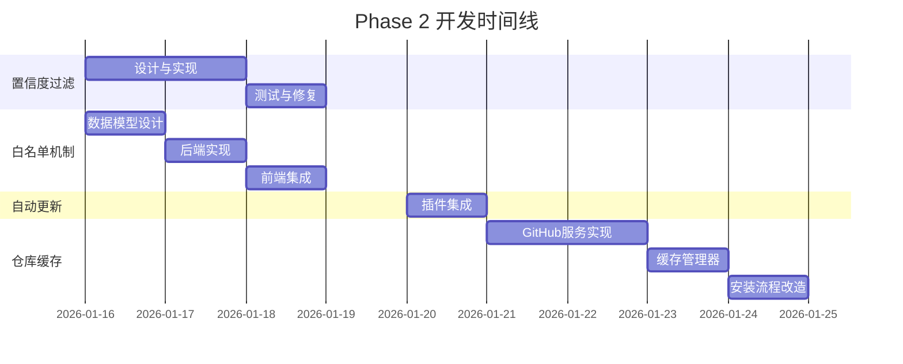

# Phase 2: 功能融合 - 开发任务清单

> **计划周期**: 2-3周  
> **目标**: 增强灵活性和专业性  
> **参考项目**: [agent-skills-guard](/Users/activer/developer/agent-skills-guard)

---

## 📋 任务总览

| 任务编号 | 任务名称 | 优先级 | 工作量 | 状态 |
|---------|---------|--------|--------|------|
| P2-01 | 置信度过滤 + 扫描模式 | P1 | 1-2天 | **Phase 2** |
| P2-02 | 白名单机制 (基础版) | P1 | 1.5天 | **Phase 2** |
| P2-03 | 自动更新集成 | P2 | 1天 | ⏳ Phase 3 |
| P2-04 | 仓库缓存机制 | P2 | 3-4天 | ⏳ Phase 3 |

> [!IMPORTANT]
> **Phase 2 范围调整 (2026-01-15)**  
> P2-03 (自动更新) 和 P2-04 (仓库缓存) 延期到 Phase 3。  
> 白名单机制先实现基础版 (技能/规则白名单)，仓库白名单和过期时间等高级功能也延期到 Phase 3。


---

## P2-01: 置信度过滤 + 扫描模式

### 📌 当前状态

Skills Manager 已具备 `Confidence` 枚举 (High/Medium/Low)，定义于 [rules.rs](file:///Users/activer/developer/skills-manager/src-tauri/src/security/rules.rs#L27-33)：

```rust
pub enum Confidence {
    High,    // 高置信度，误报可能性低
    Medium,  // 中等置信度
    Low,     // 低置信度，可能误报
}
```

**问题**: 扫描器 [scanner.rs](file:///Users/activer/developer/skills-manager/src-tauri/src/security/scanner.rs) 未使用此字段进行过滤。

### 🎯 目标

实现基于置信度的扫描模式，降低误报率 30-50%。

### 📝 详细任务

#### 任务 1.1: 定义扫描模式枚举

**文件**: `src-tauri/src/security/scanner.rs`

```rust
/// 扫描模式
#[derive(Debug, Clone, Copy, PartialEq, Eq, Serialize, Deserialize)]
pub enum ScanMode {
    /// 严格模式：报告所有匹配，包括低置信度
    Strict,
    /// 标准模式（默认）：跳过低置信度匹配
    Standard,
    /// 宽松模式：仅报告高置信度匹配
    Relaxed,
}

impl Default for ScanMode {
    fn default() -> Self {
        Self::Standard
    }
}
```

#### 任务 1.2: 修改扫描函数签名

**文件**: `src-tauri/src/security/scanner.rs`

修改 `scan_directory` 和 `scan_file` 方法，添加 `scan_mode` 参数：

```rust
pub fn scan_directory(
    &self, 
    dir_path: &str, 
    skill_id: &str, 
    locale: &str,
    scan_mode: ScanMode,  // 新增
) -> Result<SecurityReport>

pub fn scan_file(
    &self, 
    content: &str, 
    file_path: &str, 
    locale: &str,
    scan_mode: ScanMode,  // 新增
) -> Result<SecurityReport>
```

#### 任务 1.3: 实现置信度过滤逻辑

**文件**: `src-tauri/src/security/scanner.rs`

在规则匹配循环中添加过滤判断：

```rust
fn should_include_match(&self, rule: &PatternRule, mode: ScanMode) -> bool {
    match mode {
        ScanMode::Strict => true,  // 包含所有
        ScanMode::Standard => rule.confidence != Confidence::Low,  // 跳过低置信度
        ScanMode::Relaxed => rule.confidence == Confidence::High,  // 仅高置信度
    }
}
```

#### 任务 1.4: 更新 Tauri 命令

**文件**: `src-tauri/src/commands/security.rs` (如不存在则创建)

```rust
#[tauri::command]
pub async fn scan_skill_with_mode(
    skill_path: String,
    skill_id: String,
    locale: String,
    mode: Option<String>,  // "strict" | "standard" | "relaxed"
) -> Result<SecurityReport, String>
```

#### 任务 1.5: 前端集成

**文件**: `src/pages/Settings.tsx` 或相关配置页

添加扫描模式选择 UI：

```tsx
<select value={scanMode} onChange={(e) => setScanMode(e.target.value)}>
  <option value="strict">严格模式 (全部规则)</option>
  <option value="standard">标准模式 (推荐)</option>
  <option value="relaxed">宽松模式 (仅高置信度)</option>
</select>
```

### ✅ 验收标准

1. 严格模式：报告所有 72 条规则匹配
2. 标准模式：跳过 `Confidence::Low` 规则 (如 `SUBPROCESS_CALL`, `HTTP_REQUEST`)
3. 宽松模式：仅报告 `Confidence::High` 规则
4. 单元测试覆盖三种模式

### 📊 参考实现

- [agent-skills-guard/rules.rs](file:///Users/activer/developer/agent-skills-guard/src-tauri/src/security/rules.rs#L27-33): `Confidence` 枚举定义

---

## P2-02: 白名单机制

### 📌 当前状态

两个项目均未实现白名单机制。用户无法跳过已知安全的技能或规则。

### 🎯 目标

实现受信任技能/规则的白名单机制，支持用户自定义。

### 📝 详细任务

#### 任务 2.1: 设计白名单数据结构

**文件**: `src-tauri/src/models/whitelist.rs` (新建)

```rust
use serde::{Deserialize, Serialize};

/// 白名单条目类型
#[derive(Debug, Clone, Serialize, Deserialize)]
pub enum WhitelistType {
    /// 整个技能白名单
    Skill,
    /// 特定规则白名单
    Rule,
    /// 特定仓库白名单
    Repository,
}

/// 白名单条目
#[derive(Debug, Clone, Serialize, Deserialize)]
pub struct WhitelistEntry {
    pub id: String,              // 唯一标识
    pub entry_type: WhitelistType,
    pub target: String,          // skill_id / rule_id / repo_url
    pub reason: Option<String>,  // 添加原因
    pub added_by: String,        // "user" | "system"
    pub added_at: String,        // ISO 8601 时间戳
    pub expires_at: Option<String>, // 过期时间（可选）
}

/// 白名单配置
#[derive(Debug, Clone, Serialize, Deserialize, Default)]
pub struct WhitelistConfig {
    pub skills: Vec<String>,      // 白名单技能 ID
    pub rules: Vec<String>,       // 白名单规则 ID
    pub repositories: Vec<String>, // 白名单仓库 URL
    pub entries: Vec<WhitelistEntry>, // 详细条目
}
```

#### 任务 2.2: 数据库表设计

**文件**: `src-tauri/src/services/db.rs`

```sql
CREATE TABLE IF NOT EXISTS whitelist (
    id TEXT PRIMARY KEY,
    entry_type TEXT NOT NULL,  -- 'skill' | 'rule' | 'repository'
    target TEXT NOT NULL,      -- 目标标识符
    reason TEXT,
    added_by TEXT NOT NULL DEFAULT 'user',
    added_at TEXT NOT NULL,
    expires_at TEXT,
    UNIQUE(entry_type, target)
);
```

#### 任务 2.3: 白名单服务层

**文件**: `src-tauri/src/services/whitelist.rs` (新建)

```rust
pub struct WhitelistService {
    db: Arc<Database>,
}

impl WhitelistService {
    /// 检查技能是否在白名单中
    pub fn is_skill_whitelisted(&self, skill_id: &str) -> bool;
    
    /// 检查规则是否在白名单中
    pub fn is_rule_whitelisted(&self, rule_id: &str) -> bool;
    
    /// 检查仓库是否在白名单中
    pub fn is_repository_whitelisted(&self, repo_url: &str) -> bool;
    
    /// 添加到白名单
    pub fn add_to_whitelist(&self, entry: WhitelistEntry) -> Result<()>;
    
    /// 从白名单移除
    pub fn remove_from_whitelist(&self, id: &str) -> Result<()>;
    
    /// 获取所有白名单条目
    pub fn get_all_entries(&self) -> Result<Vec<WhitelistEntry>>;
    
    /// 清理过期条目
    pub fn cleanup_expired(&self) -> Result<usize>;
}
```

#### 任务 2.4: 集成到扫描器

**文件**: `src-tauri/src/security/scanner.rs`

```rust
impl SecurityScanner {
    /// 带白名单的目录扫描
    pub fn scan_directory_with_whitelist(
        &self,
        dir_path: &str,
        skill_id: &str,
        locale: &str,
        scan_mode: ScanMode,
        whitelist: &WhitelistConfig,
    ) -> Result<SecurityReport> {
        // 如果技能在白名单中，直接返回安全报告
        if whitelist.skills.contains(&skill_id.to_string()) {
            return Ok(SecurityReport::trusted(skill_id));
        }
        
        // 正常扫描，但跳过白名单中的规则
        // ...
    }
}
```

#### 任务 2.5: Tauri 命令

**文件**: `src-tauri/src/commands/whitelist.rs` (新建)

```rust
#[tauri::command]
pub async fn add_skill_to_whitelist(skill_id: String, reason: Option<String>) -> Result<(), String>;

#[tauri::command]
pub async fn add_rule_to_whitelist(rule_id: String, reason: Option<String>) -> Result<(), String>;

#[tauri::command]
pub async fn remove_from_whitelist(id: String) -> Result<(), String>;

#[tauri::command]
pub async fn get_whitelist() -> Result<Vec<WhitelistEntry>, String>;
```

#### 任务 2.6: 前端白名单管理界面

**文件**: `src/components/WhitelistManager.tsx` (新建)

功能要点：
- 显示当前白名单条目列表
- 添加/移除白名单条目
- 显示白名单类型标签 (技能/规则/仓库)
- 支持搜索和过滤
- 显示添加原因和过期时间

### ✅ 验收标准

1. 可添加技能到白名单，后续扫描跳过该技能
2. 可添加规则到白名单，后续扫描跳过该规则
3. 白名单持久化到数据库
4. 支持过期时间设置
5. UI 界面可管理白名单

### 📊 预期误报率改善

- 常见 false positive 规则 (如 `SUBPROCESS_CALL`, `HTTP_REQUEST`) 可被用户针对性白名单
- 受信任的知名仓库 (如 anthropics/courses) 可整体白名单

---

## P2-03: 自动更新集成

### 📌 当前状态

- **Skills Manager**: 无自动更新机制
- **Agent Skills Guard**: 已集成 `tauri-plugin-updater` v2.0

### 🎯 目标

集成 Tauri 自动更新插件，支持应用版本检查和更新。

### 📝 详细任务

#### 任务 3.1: 添加依赖

**文件**: `src-tauri/Cargo.toml`

```toml
[dependencies]
tauri-plugin-updater = "2.0"
```

**文件**: `package.json`

```json
{
  "dependencies": {
    "@tauri-apps/plugin-updater": "^2.0.0"
  }
}
```

#### 任务 3.2: 初始化插件

**文件**: `src-tauri/src/lib.rs`

```rust
use tauri_plugin_updater::UpdaterBuilder;

pub fn run() {
    tauri::Builder::default()
        .plugin(tauri_plugin_updater::Builder::new().build())
        // ...其他插件
        .run(tauri::generate_context!())
        .expect("error while running tauri application");
}
```

#### 任务 3.3: 配置更新 endpoint

**文件**: `src-tauri/tauri.conf.json`

```json
{
  "plugins": {
    "updater": {
      "endpoints": [
        "https://github.com/YOUR_REPO/releases/latest/download/latest.json"
      ],
      "pubkey": "YOUR_PUBLIC_KEY"
    }
  }
}
```

#### 任务 3.4: 前端更新检查 UI

**文件**: `src/components/UpdateChecker.tsx` (新建)

```tsx
import { check } from '@tauri-apps/plugin-updater';
import { relaunch } from '@tauri-apps/plugin-process';

export function UpdateChecker() {
  const [updateAvailable, setUpdateAvailable] = useState(false);
  const [updateInfo, setUpdateInfo] = useState(null);
  
  const checkForUpdates = async () => {
    const update = await check();
    if (update) {
      setUpdateAvailable(true);
      setUpdateInfo(update);
    }
  };
  
  const installUpdate = async () => {
    if (updateInfo) {
      await updateInfo.downloadAndInstall();
      await relaunch();
    }
  };
  
  // UI 渲染...
}
```

#### 任务 3.5: 设置页集成

**文件**: `src/pages/Settings.tsx`

添加更新检查按钮和版本信息显示。

### ✅ 验收标准

1. 应用启动时自动检查更新
2. 设置页可手动检查更新
3. 有更新时显示更新对话框
4. 支持下载并安装更新
5. 更新完成后自动重启

### ⚠️ 注意事项

- 需要配置 GitHub Releases 或其他更新服务器
- 需要生成签名密钥对
- 测试需要发布真实的更新版本

### 📊 参考实现

- [agent-skills-guard/Cargo.toml](file:///Users/activer/developer/agent-skills-guard/src-tauri/Cargo.toml#L23): `tauri-plugin-updater = "2.0"`
- [Tauri Updater 官方文档](https://v2.tauri.app/plugin/updater/)

---

## P2-04: 仓库缓存机制

### 📌 当前状态

| 维度 | Skills Manager | Agent Skills Guard |
|------|---------------|-------------------|
| 下载方式 | Git Clone | GitHub API + Zipball |
| Git 依赖 | 需要本地 Git | 不需要 |
| 缓存策略 | 无 | ZIP 解压到缓存目录 |
| Commit 追踪 | 无 | 从目录名提取 SHA |

### 🎯 目标

实现 ZIP-based 仓库缓存机制：
- 减少对本地 Git 的依赖
- 提升下载速度
- 支持离线访问已缓存仓库

### 📝 详细任务

#### 任务 4.1: 添加 ZIP 解压依赖

**文件**: `src-tauri/Cargo.toml`

```toml
[dependencies]
zip = "2.2"
```

#### 任务 4.2: 创建 GitHub 服务层

**文件**: `src-tauri/src/services/github.rs` (新建或重写)

参考 [agent-skills-guard/github.rs](file:///Users/activer/developer/agent-skills-guard/src-tauri/src/services/github.rs)

核心功能：

```rust
pub struct GitHubService {
    client: Client,
    api_base: String,
}

impl GitHubService {
    /// 下载仓库压缩包并解压到本地缓存
    /// 返回值：(extract_dir, commit_sha)
    pub async fn download_repository_archive(
        &self,
        owner: &str,
        repo: &str,
        cache_base_dir: &Path,
    ) -> Result<(PathBuf, String)>;
    
    /// 解压 ZIP 文件
    fn extract_zip(&self, archive_path: &Path, extract_dir: &Path) -> Result<()>;
    
    /// 从缓存目录名提取 commit SHA
    /// GitHub zipball 解压后的目录名格式：{owner}-{repo}-{commit_sha}
    pub fn extract_commit_sha_from_cache(&self, extract_dir: &Path) -> Result<String>;
    
    /// 从本地缓存扫描 skills（不需要 API 请求）
    pub fn scan_cached_repository(
        &self,
        cache_path: &Path,
        repo_url: &str,
        scan_subdirs: bool,
    ) -> Result<Vec<Skill>>;
    
    /// 检查技能是否有更新
    pub async fn check_skill_update(
        &self,
        owner: &str,
        repo: &str,
        skill_path: &str,
        installed_commit_sha: Option<&str>,
    ) -> Result<Option<String>>;
}
```

#### 任务 4.3: 缓存目录结构设计

```
~/.skill-manager/cache/
├── repositories/
│   ├── anthropics_courses/
│   │   ├── archive.zip           # 原始压缩包
│   │   └── extracted/            # 解压目录
│   │       └── anthropics-courses-abc1234/  # GitHub 格式
│   │           ├── skill-1/
│   │           │   └── SKILL.md
│   │           └── skill-2/
│   │               └── SKILL.md
│   └── modelcontextprotocol_servers/
│       └── ...
└── metadata.json                 # 缓存元数据
```

#### 任务 4.4: 缓存元数据管理

**文件**: `src-tauri/src/services/cache.rs` (增强现有)

```rust
/// 仓库缓存元数据
#[derive(Debug, Clone, Serialize, Deserialize)]
pub struct RepoCacheMetadata {
    pub repo_url: String,
    pub owner: String,
    pub repo: String,
    pub commit_sha: String,
    pub cached_at: String,       // ISO 8601
    pub last_accessed: String,
    pub size_bytes: u64,
    pub skill_count: usize,
}

/// 缓存管理器
pub struct CacheManager {
    cache_dir: PathBuf,
    metadata: HashMap<String, RepoCacheMetadata>,
}

impl CacheManager {
    /// 检查仓库是否已缓存
    pub fn is_cached(&self, repo_url: &str) -> bool;
    
    /// 获取缓存路径
    pub fn get_cache_path(&self, repo_url: &str) -> Option<PathBuf>;
    
    /// 检查缓存是否过期
    pub fn is_cache_expired(&self, repo_url: &str, max_age_hours: u64) -> bool;
    
    /// 清理过期缓存
    pub fn cleanup_expired(&mut self, max_age_hours: u64) -> Result<usize>;
    
    /// 清理所有缓存
    pub fn clear_all(&mut self) -> Result<usize>;
    
    /// 获取缓存统计
    pub fn get_stats(&self) -> CacheStats;
}
```

#### 任务 4.5: API 限流处理

**文件**: `src-tauri/src/services/github.rs`

```rust
impl GitHubService {
    /// 检查 GitHub API 限流状态
    fn check_rate_limit(&self, response: &reqwest::Response) -> Result<()> {
        if let Some(remaining) = response.headers().get("x-ratelimit-remaining") {
            if let Ok(remaining_str) = remaining.to_str() {
                if remaining_str == "0" {
                    if let Some(reset) = response.headers().get("x-ratelimit-reset") {
                        // 计算等待时间并返回友好错误
                        // ...
                    }
                    return Err(anyhow!("GitHub API 速率限制已达上限"));
                }
            }
        }
        Ok(())
    }
}
```

#### 任务 4.6: 技能安装流程改造

**文件**: `src-tauri/src/lib.rs` 或 `src-tauri/src/commands/skill.rs`

改造后的安装流程：

```
1. 检查本地缓存是否存在且未过期
   ├─ 存在且有效 → 直接使用缓存
   └─ 不存在或过期 → 下载 zipball

2. 下载仓库 zipball (如需要)
   ├─ 尝试 main 分支
   └─ 回退到 master 分支

3. 解压到缓存目录

4. 扫描缓存中的技能

5. 执行安全扫描

6. 复制到目标安装目录
```

#### 任务 4.7: 前端缓存管理界面

**文件**: `src/pages/Settings.tsx` 或 `src/components/CacheManager.tsx`

功能要点：
- 显示缓存统计 (已缓存仓库数、总大小)
- 清理过期缓存按钮
- 清理所有缓存按钮
- 设置缓存过期时间

### ✅ 验收标准

1. 技能安装不再依赖本地 Git
2. 首次安装下载 zipball 并缓存
3. 再次安装同一仓库技能时使用缓存
4. 缓存过期后自动重新下载
5. 支持手动清理缓存
6. 正确追踪 commit SHA 用于更新检测

### 📊 性能预期

| 场景 | 改进前 (Git Clone) | 改进后 (Zipball Cache) |
|------|-------------------|----------------------|
| 首次安装 | ~30s (完整 clone) | ~10s (zipball 更小) |
| 重复安装 | ~30s (重新 clone) | ~1s (使用缓存) |
| 离线安装 | ❌ 不支持 | ✅ 使用已缓存仓库 |
| Git 依赖 | 需要本地 Git | 不需要 |

### 📊 参考实现

- [agent-skills-guard/github.rs](file:///Users/activer/developer/agent-skills-guard/src-tauri/src/services/github.rs#L370-453): `download_repository_archive`
- [agent-skills-guard/github.rs](file:///Users/activer/developer/agent-skills-guard/src-tauri/src/services/github.rs#L455-494): `extract_zip`
- [agent-skills-guard/github.rs](file:///Users/activer/developer/agent-skills-guard/src-tauri/src/services/github.rs#L523-567): `scan_cached_repository`

---

## 🧪 验证计划

### 单元测试

每个任务需要添加对应的单元测试：

```bash
# 运行所有后端测试
cd src-tauri && cargo test

# 运行特定模块测试
cargo test security::scanner::tests
cargo test services::whitelist::tests
cargo test services::github::tests
```

### 集成测试

1. **置信度过滤测试**: 创建包含不同置信度规则匹配的测试技能，验证三种模式的过滤行为
2. **白名单测试**: 添加技能到白名单，验证后续扫描跳过该技能
3. **缓存测试**: 首次下载后断网，验证可从缓存安装

### 手动验收测试

| 测试场景 | 预期结果 |
|---------|---------|
| 切换扫描模式为宽松 | 扫描结果仅显示高置信度匹配 |
| 添加技能到白名单 | 白名单技能不再触发警告 |
| 检查更新 | 显示更新对话框（如有新版本） |
| 首次安装技能 | 下载 zipball 并缓存 |
| 再次安装同仓库技能 | 使用缓存，秒级完成 |
| 清理缓存 | 缓存目录被清空 |

---

## 📅 时间线规划



---

## 📚 附录

### A. 相关文件路径

| 文件 | 路径 | 描述 |
|------|------|------|
| 安全规则 | `src-tauri/src/security/rules.rs` | 规则定义，含 Confidence 枚举 |
| 扫描器 | `src-tauri/src/security/scanner.rs` | 核心扫描逻辑 |
| 数据库服务 | `src-tauri/src/services/db.rs` | SQLite 操作 |
| 缓存服务 | `src-tauri/src/services/cache.rs` | LRU 缓存实现 |
| 主入口 | `src-tauri/src/lib.rs` | Tauri 命令注册 |
| 设置页 | `src/pages/Settings.tsx` | 前端设置界面 |

### B. 参考项目关键实现

| 功能 | Agent Skills Guard 文件 | 行号 |
|------|-------------------------|------|
| Confidence 枚举 | `rules.rs` | L27-33 |
| ZIP 下载解压 | `github.rs` | L370-494 |
| 缓存扫描 | `github.rs` | L523-567 |
| 更新检查 | `github.rs` | L660-741 |
| 限流处理 | `github.rs` | L496-521 |

### C. 数据库迁移

Phase 2 需要新增的数据库表：

```sql
-- 白名单表
CREATE TABLE IF NOT EXISTS whitelist (
    id TEXT PRIMARY KEY,
    entry_type TEXT NOT NULL,
    target TEXT NOT NULL,
    reason TEXT,
    added_by TEXT NOT NULL DEFAULT 'user',
    added_at TEXT NOT NULL,
    expires_at TEXT,
    UNIQUE(entry_type, target)
);

-- 仓库缓存元数据表
CREATE TABLE IF NOT EXISTS repo_cache (
    id TEXT PRIMARY KEY,
    repo_url TEXT NOT NULL UNIQUE,
    owner TEXT NOT NULL,
    repo TEXT NOT NULL,
    commit_sha TEXT NOT NULL,
    cached_at TEXT NOT NULL,
    last_accessed TEXT NOT NULL,
    size_bytes INTEGER,
    skill_count INTEGER
);
```
