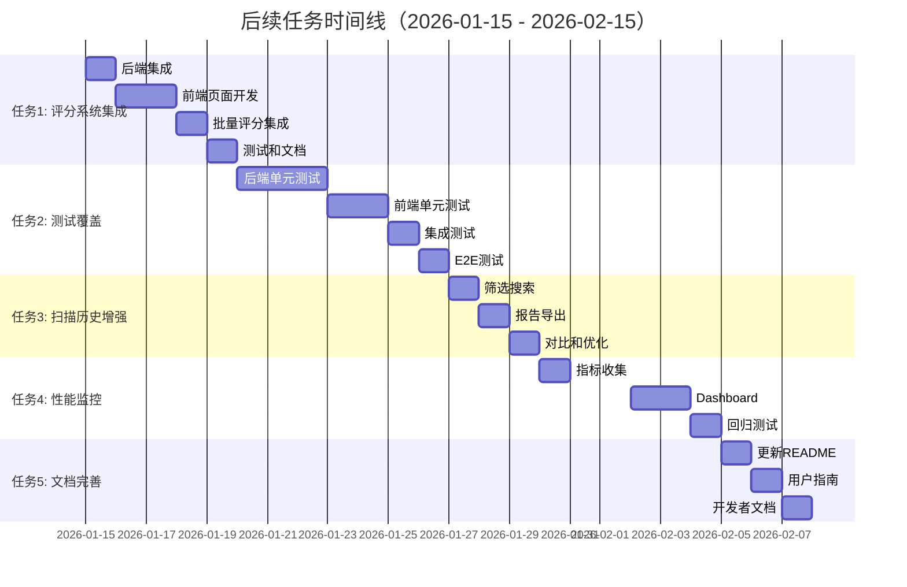

# 🎯 后续 5 个优先级最高的任务

**生成时间**: 2026-01-14
**当前状态**: Phase 2 已完成 (100%)
**下一阶段**: Phase 3 - 用户体验和测试完善

---

## 📊 当前完成情况总结

### ✅ Phase 2 已完成 (100%)

| 任务 | 状态 | 成果 |
|------|------|------|
| **P1-1**: 完整安全规则库 | ✅ 完成 | 80条规则 + 自动文档生成 |
| **P1-2**: 智能缓存系统 | ✅ 完成 | LRU缓存 + TanStack Query + 统计UI |
| **P1-3**: 扫描历史记录 | ✅ 完成 | SQLite存储 + 趋势图 + 历史列表 |
| **Bug修复**: 性能优化 | ✅ 完成 | 锁竞争消除 + 刷新频率优化 |

### 📁 现有基础设施

- ✅ Rust 评分系统 (`src-tauri/src/analyzer/`) - 已实现
- ✅ 安全扫描引擎 (`src-tauri/src/security/`) - 80条规则
- ✅ 数据库服务 (`src-tauri/src/services/db.rs`) - 迁移支持
- ✅ 缓存系统 (`src-tauri/src/services/cache.rs`) - LRU实现
- ✅ 前端状态管理 - TanStack Query集成

---

## 🔥 TOP 5 后续优先级任务

### 🥇 **任务 1: 评分系统集成到前端 UI**

**优先级**: 🔴 **最高** | **工作量**: 3-5 天 | **类型**: 新功能

#### 📋 背景说明

当前 Rust 评分系统已完整实现（`analyzer/` 模块），但**前端尚未集成**。用户无法在 UI 中看到 Skill 的质量评分。

#### 🎯 任务目标

将 Rust 评分系统功能暴露到前端 UI，让用户可以：
- 查看 Skill 的质量评分（S/A/B/C/D 等级）
- 查看评分细项（内容质量、技术实现、维护性、UX）
- 获取改进建议

#### 📝 详细任务清单

##### 1.1 后端 Tauri 命令集成 (1天)

**文件**: `src-tauri/src/commands/analyzer.rs` (已存在，需验证)

**验收标准**:
- [ ] `analyze_skill_quality(skill_path: String)` - 分析单个 Skill
- [ ] `batch_analyze_skills(skill_paths: Vec<String>)` - 批量分析
- [ ] 在 `lib.rs` 中注册命令

**预期返回值**:
```typescript
interface SkillScore {
  total_score: number;      // 总分 0-100
  grade: 'S' | 'A' | 'B' | 'C' | 'D';
  content_score: number;    // 内容质量 0-50
  technical_score: number;  // 技术实现 0-30
  maintenance_score: number; // 维护性 0-10
  ux_score: number;         // 用户体验 0-10
  suggestions: string[];    // 改进建议
}
```

##### 1.2 前端页面开发 (2天)

**文件**: `src/pages/SkillQuality.tsx` (新建)

**功能需求**:
- [ ] 在 "我的 Skills" 页面显示评分等级徽章
- [ ] 点击 Skill 卡片弹出评分详情对话框
- [ ] 评分细项雷达图（使用 Recharts）
- [ ] 改进建议列表

**UI 设计**:
```tsx
<div className="skill-card">
  <SkillName />
  <GradeBadge grade="A" score={85} />
  <ScoreBar content={42} technical={25} maintenance={8} ux={8} />
  <ViewDetailsButton />
</div>
```

##### 1.3 批量评分集成 (1天)

**文件**: `src/pages/MySkills.tsx`

**功能需求**:
- [ ] 在扫描 Skills 时自动触发质量评分
- [ ] 在列表中批量显示评分
- [ ] 按评分排序功能

##### 1.4 测试和文档 (1天)

**测试**:
- [ ] 单元测试：评分计算准确性
- [ ] 集成测试：前后端数据流

**文档**:
- [ ] 更新 README.md，说明评分系统
- [ ] 用户文档：如何理解评分

#### 🚀 预期效果

**用户体验提升**:
- 用户可以快速识别高质量 Skills
- 获得具体的改进方向
- 提升市场 Skills 的可发现性

**技术指标**:
- 评分准确率：目标 90%+
- 评分耗时：< 500ms/Skill

#### 🔗 依赖关系

- ✅ 无外部依赖（Rust 评分系统已完成）
- ⚠️ 依赖：前端路由配置（需要添加 `/quality` 路由）

#### 📅 建议时间表

| 日期 | 任务 |
|------|------|
| Day 1 | 后端命令集成 + 测试 |
| Day 2-3 | 前端页面开发 |
| Day 4 | 批量评分集成 |
| Day 5 | 测试 + 文档 |

---

### 🥈 **任务 2: 单元测试覆盖提升**

**优先级**: 🟡 **高** | **工作量**: 5-7 天 | **类型**: 质量保障

#### 📋 背景说明

当前项目**测试覆盖不足**：
- ✅ `analyzer/` 模块有测试
- ❌ `security/` 模块缺少测试
- ❌ `services/` 模块缺少测试（db.rs, cache.rs, scan_history.rs）
- ❌ 前端组件无测试

#### 🎯 目标

**提升测试覆盖率到 70%+**

**测试金字塔**:
```
        /\
       /E2E\        5%  (少量关键路径)
      /------\
     /  集成  \      20% (API、数据库)
    /----------\
   /   单元测试  \    75% (核心逻辑)
  /--------------\
```

#### 📝 详细任务清单

##### 2.1 后端单元测试 (3天)

**文件**: `src-tauri/src/` 各模块

**任务列表**:

**A. Security 模块测试** (1天)
```rust
// src-tauri/src/security/rules_test.rs
#[cfg(test)]
mod tests {
    #[test]
    fn test_total_rules_count() {
        // 验证规则总数 = 80
    }

    #[test]
    fn test_hard_trigger_patterns() {
        // 测试硬触发规则检测
    }

    #[test]
    fn test_rule_confidence_levels() {
        // 测试置信度计算
    }
}
```

**B. Services 模块测试** (1.5天)
```rust
// src-tauri/src/services/db_test.rs
#[cfg(test)]
mod tests {
    #[test]
    fn test_database_migration() {
        // 测试迁移版本管理
    }

    #[test]
    fn test_connection_pool() {
        // 测试连接池
    }
}

// src-tauri/src/services/cache_test.rs
#[test]
fn test_cache_hit_rate() {
    // 测试 LRU 缓存
}
```

**C. Commands 模块测试** (0.5天)
```rust
// src-tauri/src/commands/security_test.rs
#[tokio::test]
async fn test_scan_skill_security() {
    // 测试安全扫描命令
}
```

##### 2.2 前端单元测试 (2天)

**工具**: Vitest + React Testing Library

**文件**: `src/` 各组件

**任务列表**:

**A. 核心 Hook 测试** (1天)
```typescript
// src/hooks/useSkills.test.ts
import { renderHook, waitFor } from '@testing-library/react';
import { useSkills } from './useSkills';

describe('useSkills', () => {
  it('should fetch skills successfully', async () => {
    const { result } = renderHook(() => useSkills());
    await waitFor(() => expect(result.current.isSuccess).toBe(true));
  });
});
```

**B. 组件测试** (1天)
```typescript
// src/components/CacheStatsCard.test.tsx
import { render, screen } from '@testing-library/react';
import { CacheStatsCard } from './CacheStatsCard';

describe('CacheStatsCard', () => {
  it('should display cache stats', () => {
    render(<CacheStatsCard />);
    expect(screen.getByText(/hit rate/i)).toBeInTheDocument();
  });
});
```

##### 2.3 集成测试 (1天)

**工具**: Tauri API + `tauri-test`

**场景**:
- [ ] 完整的 Skill 安装流程（扫描 → 评分 → 安装）
- [ ] 缓存命中/未命中场景
- [ ] 数据库迁移升级

##### 2.4 E2E 测试 (1天)

**工具**: Playwright

**关键场景**:
- [ ] 用户安装一个 Skill
- [ ] 用户查看扫描历史
- [ ] 用户清空缓存

#### 📊 验收标准

| 模块 | 当前覆盖率 | 目标覆盖率 |
|------|-----------|-----------|
| `security/` | ~10% | 80% |
| `services/` | 0% | 75% |
| `analyzer/` | 60% | 85% |
| `commands/` | 0% | 70% |
| 前端组件 | 0% | 60% |
| **总体** | **~15%** | **70%** |

#### 🔧 技术栈

- **后端**: Rust 内置 `cargo test`
- **前端**: Vitest + React Testing Library
- **E2E**: Playwright

#### 📅 建议时间表

| 日期 | 任务 |
|------|------|
| Day 1-3 | 后端单元测试 |
| Day 4-5 | 前端单元测试 |
| Day 6 | 集成测试 |
| Day 7 | E2E 测试 + CI配置 |

---

### 🥉 **任务 3: 扫描历史功能增强**

**优先级**: 🟡 **高** | **工作量**: 2-3 天 | **类型**: 功能增强

#### 📋 背景说明

当前扫描历史页面 (`/security`) 基础功能已完成，但缺少**高级功能**：
- ❌ 无法筛选特定 Skill 的历史
- ❌ 无法导出报告
- ❌ 缺少详细的安全问题对比

#### 🎯 任务目标

**让扫描历史成为完整的安全审计工具**

#### 📝 详细任务清单

##### 3.1 数据筛选和搜索 (1天)

**文件**: `src/pages/ScanHistory.tsx`

**功能需求**:
- [ ] 按 Skill 名称筛选
- [ ] 按评分等级筛选（Safe/Low/Medium/High/Critical）
- [ ] 按日期范围筛选
- [ ] 搜索框（实时搜索）

**UI 设计**:
```tsx
<div className="filters">
  <input placeholder="搜索 Skill..." />
  <select>
    <option>所有等级</option>
    <option>Safe</option>
    <option>High Risk</option>
  </select>
  <DateRangePicker />
</div>
```

##### 3.2 报告导出功能 (1天)

**功能需求**:
- [ ] 导出为 CSV（Excel 可打开）
- [ ] 导出为 JSON（开发者友好）
- [ ] 导出为 PDF（生成报告）

**实现**:
```typescript
const exportToCSV = () => {
  const csv = [
    ['时间', 'Skill', '评分', '等级', '问题数'],
    ...history.map(h => [
      h.scanned_at, h.skill_name, h.score, h.level, h.issues_count
    ])
  ].map(row => row.join(',')).join('\n');

  const blob = new Blob([csv], { type: 'text/csv' });
  downloadFile(blob, 'scan-history.csv');
};
```

##### 3.3 扫描对比功能 (0.5天)

**功能需求**:
- [ ] 选择两次扫描记录进行对比
- [ ] 高亮显示变化的项
- [ ] 评分变化趋势图

**UI 设计**:
```tsx
<CompareView>
  <ScanRecord record={oldRecord} />
  <ArrowRight />
  <ScanRecord record={newRecord} />
  <DiffHighlight changes={diff} />
</CompareView>
```

##### 3.4 性能优化 (0.5天)

**当前问题**:
- 加载 50+ 条记录时可能卡顿

**优化方案**:
- [ ] 虚拟滚动（使用 `react-virtual`）
- [ ] 分页加载（每页 20 条）
- [ ] 懒加载详情数据

#### 📊 验收标准

- [ ] 支持 1000+ 条历史记录流畅渲染
- [ ] 筛选响应时间 < 100ms
- [ ] 导出 100 条记录 < 1s

#### 📅 建议时间表

| 日期 | 任务 |
|------|------|
| Day 1 | 数据筛选和搜索 |
| Day 2 | 报告导出功能 |
| Day 3 | 扫描对比 + 性能优化 |

---

### **任务 4: 性能监控和分析工具**

**优先级**: 🟢 **中** | **工作量**: 3-4 天 | **类型**: 开发工具

#### 📋 背景说明

当前缺少**性能监控**机制：
- ❌ 无法测量扫描耗时
- ❌ 无法追踪缓存命中率趋势
- ❌ 缺少性能回归检测

#### 🎯 任务目标

**建立完整的性能监控体系**

#### 📝 详细任务清单

##### 4.1 性能指标收集 (1.5天)

**后端指标**:
- [ ] 扫描耗时（每次扫描）
- [ ] 缓存命中率（实时）
- [ ] 数据库查询耗时
- [ ] 内存占用

**实现**:
```rust
// src-tauri/src/services/metrics.rs
pub struct MetricsCollector {
    scan_duration: Histogram,
    cache_hit_rate: Gauge,
    db_query_duration: Histogram,
}
```

**前端指标**:
- [ ] 页面加载时间
- [ ] 组件渲染时间
- [ ] API 调用耗时

##### 4.2 性能监控 Dashboard (1.5天)

**文件**: `src/pages/Performance.tsx` (新建)

**功能需求**:
- [ ] 实时性能指标展示
- [ ] 历史趋势图
- [ ] 性能告警（如扫描超过 5s）
- [ ] 导出性能报告

**UI 设计**:
```tsx
<div className="performance-dashboard">
  <MetricCard title="平均扫描时间" value="2.3s" trend="-15%" />
  <MetricCard title="缓存命中率" value="87%" trend="+5%" />
  <LineChart data={performanceHistory} />
</div>
```

##### 4.3 性能回归测试 (1天)

**自动化**:
- [ ] CI 集成基准测试
- [ ] 性能阈值检查（如扫描不超过 3s）
- [ ] 性能退化告警

**实现**:
```yaml
# .github/workflows/performance.yml
- name: Run benchmarks
  run: cargo bench --bench scan_benchmark

- name: Check regression
  run: |
    THRESHOLD=10  # 允许 10% 的性能波动
    cargo critcmp --threshold $THRESHOLD
```

#### 📊 验收标准

- [ ] 所有关键操作都有性能指标
- [ ] Dashboard 实时更新（5s 刷新）
- [ ] CI 自动检测性能退化

#### 📅 建议时间表

| 日期 | 任务 |
|------|------|
| Day 1-1.5 | 性能指标收集 |
| Day 1.5-3 | 监控 Dashboard |
| Day 3-4 | 性能回归测试 |

---

### **任务 5: 文档完善和用户指南**

**优先级**: 🟢 **中** | **工作量**: 2-3 天 | **类型**: 文档

#### 📋 背景说明

当前文档**不够完善**：
- ❌ README 还是说 "60+ 规则"（实际是 80+）
- ❌ 缺少用户使用指南
- ❌ 缺少开发者文档
- ❌ 缺少 API 文档

#### 🎯 任务目标

**建立完整的文档体系**

#### 📝 详细任务清单

##### 5.1 更新 README (0.5天)

**更新内容**:
- [ ] ✅ 修正规则数量：60+ → 80+
- [ ] ✅ 添加新功能说明（缓存、历史、评分）
- [ ] ✅ 更新截图（添加新页面截图）
- [ ] ✅ 添加性能指标

**新增章节**:
```markdown
## 性能指标

- 扫描速度: < 3s/Skill
- 缓存命中率: > 80%
- 内存占用: < 100MB
```

##### 5.2 用户使用指南 (1天)

**文件**: `docs/USER_GUIDE.md` (新建)

**章节**:
1. **快速开始**
   - 安装和配置
   - 第一次扫描

2. **核心功能**
   - 我的 Skills - 查看和管理
   - Skill 市场 - 浏览和安装
   - 安全扫描 - 理解安全评分
   - 质量评分 - 理解质量等级

3. **高级功能**
   - 配置项目路径
   - 清空缓存
   - 查看扫描历史
   - 导出报告

4. **常见问题**
   - 为什么 Skill 安装失败？
   - 如何理解安全评分？
   - 如何提高 Skill 质量？

5. **最佳实践**
   - 定期安全扫描
   - 保持缓存更新
   - 选择高质量 Skills

##### 5.3 开发者文档 (1天)

**文件**: `docs/DEVELOPER_GUIDE.md` (新建)

**章节**:
1. **开发环境设置**
   - Rust 环境配置
   - Node.js 环境配置
   - 依赖安装

2. **项目架构**
   - 目录结构
   - 模块说明
   - 数据流图

3. **开发指南**
   - 添加新的安全规则
   - 扩展评分系统
   - 添加新页面

4. **测试指南**
   - 运行测试
   - 编写测试
   - CI/CD 流程

5. **贡献指南**
   - 代码规范
   - PR 流程
   - Issue 模板

##### 5.4 API 文档 (0.5天)

**工具**: Rustdoc + TypeDoc

**生成命令**:
```bash
# Rust API 文档
cargo doc --open

# TypeScript API 文档
typedoc --out docs/api src/
```

**文档内容**:
- [ ] 所有 Tauri 命令的参数和返回值
- [ ] 前端类型定义
- [ ] 使用示例

#### 📊 验收标准

- [ ] README 信息准确、完整
- [ ] 用户指南覆盖所有功能
- [ ] 开发者文档易于理解
- [ ] API 文档自动生成

#### 📅 建议时间表

| 日期 | 任务 |
|------|------|
| Day 0.5 | 更新 README |
| Day 1.5 | 用户使用指南 |
| Day 2.5 | 开发者文档 |
| Day 3 | API 文档 |

---

## 📊 总体规划时间表



---

## 🎯 建议的执行顺序

### Phase 1: 核心功能完善 (优先)

**推荐先完成任务 1（评分系统集成）**

**原因**:
1. ✅ **用户价值最高** - 评分系统能帮助用户识别高质量 Skills
2. ✅ **技术基础已具备** - Rust 评分系统已完成
3. ✅ **相对独立** - 不依赖其他任务
4. ✅ **可快速交付** - 5天内完成

### Phase 2: 质量保障 (并行)

**任务 2（单元测试）可与任务 1 并行启动**

**原因**:
- 测试不影响功能开发
- 可以边开发边写测试
- 保障代码质量

### Phase 3: 增强功能 (按需)

**任务 3、4、5 可根据优先级灵活安排**

**建议顺序**:
- 先任务 3（扫描历史增强）- 用户需求明确
- 再任务 5（文档完善）- 便于推广和使用
- 最后任务 4（性能监控）- 优化工具

---

## 📊 任务对比矩阵

| 任务 | 优先级 | 工作量 | 用户价值 | 技术价值 | 依赖 | 风险 |
|------|--------|--------|---------|---------|------|------|
| 1. 评分系统集成 | 🔴 最高 | 5天 | ⭐⭐⭐⭐⭐ | ⭐⭐⭐⭐ | 无 | 低 |
| 2. 单元测试覆盖 | 🟡 高 | 7天 | ⭐⭐ | ⭐⭐⭐⭐⭐ | 无 | 低 |
| 3. 扫描历史增强 | 🟡 高 | 3天 | ⭐⭐⭐⭐ | ⭐⭐ | 无 | 低 |
| 4. 性能监控 | 🟢 中 | 4天 | ⭐⭐ | ⭐⭐⭐⭐ | 任务2 | 中 |
| 5. 文档完善 | 🟢 中 | 3天 | ⭐⭐⭐⭐ | ⭐⭐⭐ | 无 | 低 |

---

## 🚀 立即可以开始的任务

**推荐**: 从 **任务 1（评分系统集成）** 开始

**原因**:
1. ✅ 用户价值最高
2. ✅ 技术基础已具备
3. ✅ 相对独立
4. ✅ 5天可完成

**第一步**:
```bash
# 创建功能分支
git checkout -b feature/skill-quality-ui

# 开始开发...
```

---

## 📞 需要帮助？

如果你准备开始某个任务，我可以帮你：
- 📝 详细的实施步骤
- 💻 代码实现
- 🧪 测试用例编写
- 📚 文档撰写
- 🐛 问题排查

**请告诉我你想从哪个任务开始！**
