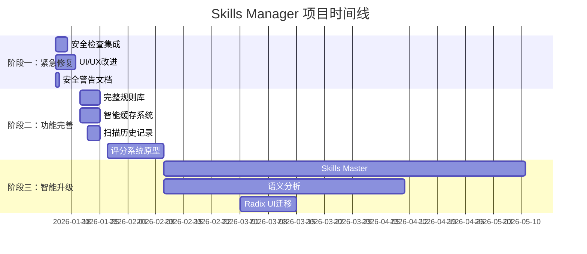

# Skills Manager 项目任务清单与路线图

**文档版本**: 1.0
**创建日期**: 2026-01-14
**基于文档**: task-security.md, agent-skills-guard-analysis.md, ui-analysis.md, task-upgrade.md

---

## 📋 执行摘要

根据四个分析文档的深度研究，Skills Manager 项目目前面临 **三大核心问题**：

1. **🔴 安全检查功能完全缺失** - 所有 Skills 被默认标记为"安全"，存在严重安全风险
2. **🟡 用户体验基础** - 使用 Alert 阻断式通知，无缓存机制，手动刷新
3. **🟢 评分系统待升级** - 从"规则校验"向"智能语义评审"演进

本任务清单将这些问题按 **优先级** 和 **并发性** 进行阶段划分，确保团队能够高效协作，快速交付核心价值。

---

## 🎯 总体策略：三步走战略

### 第一步：紧急修复（1-2 周）⚡
**目标**：解决安全和用户体验的核心痛点
- ✅ 集成 Agent Skills Guard 的安全扫描引擎
- ✅ 实现基础 UI/UX 改进（Sonner + 骨架屏）
- ✅ 添加安全警告和免责声明

### 第二步：功能完善（1-2 周）✅
**目标**：建立完整的安全和历史记录系统
- ✅ 完整的安全检查规则库（80+ 条）
- ✅ 智能缓存机制（后端 + 前端统计 UI）
- ✅ 安全扫描历史记录（DB + 趋势图）

### 第三步：智能升级（3-6 个月）🚀
**目标**：实现 AI 驱动的智能评审
- ✅ 多 Agent 专家审计架构（P3-1）
- ✅ Skills Master 自动进化引擎
- ✅ 语义分析和污点追踪

---

## 📊 任务优先级矩阵

| 优先级 | 任务类型 | 工作量 | 影响范围 | 紧急程度 | 状态 |
|--------|---------|--------|---------|---------|------|
| 🔴 P0 | 安全检查集成 | 1-2 周 | 全局 | 极高 | ✅ |
| 🔴 P0 | UI/UX 紧急改进 | 1 周 | 用户体验 | 高 | ✅ |
| 🟡 P1 | 完整安全规则库 | 3-5 天 | 安全 | 高 | ✅ |
| 🟡 P1 | 智能缓存系统 | 3-5 天 | 性能 | 中 | ✅ |
| 🟡 P1 | 扫描历史记录 | 2-3 天 | 功能 | 中 | ✅ |
| 🟢 P2 | 多 Agent 评分 | 2-3 周 | 评分 | 中 | 🔄 |
| 🟢 P2 | Radix UI 迁移 | 1-2 周 | UI | 低 | ⏳ |
| ⚪ P3 | Skills Master | 2-3 个月 | 创新 | 中 | ⏳ |

---

## 🚀 阶段一：紧急修复（Week 1-2）

**目标**：快速解决安全和用户体验的核心痛点
**并发要求**：前端 + 后端并行开发
**里程碑**：可发布的安全检查版本 v1.3.0

### 🔴 P0-1: 安全检查引擎集成（后端）

**工作量**: 2-3 天
**优先级**: 🔴 极高
**并发**: ✅ 可与 P0-2 并行

#### 任务清单

- [x] **Day 1-2**: 复制安全扫描模块
  - [x] 复制 `agent-skills-guard/src-tauri/src/security/` 到 `src-tauri/src/`
  - [x] 复制 `agent-skills-guard/src-tauri/src/models/security.rs` 到 `src-tauri/src/models/`
  - [x] 复制 `agent-skills-guard/src-tauri/src/commands/security.rs` 到 `src-tauri/src/commands/`

- [x] **Day 2**: 修改 Cargo.toml
  ```toml
  [dependencies]
  regex = "1.10"
  lazy_static = "1.4"
  walkdir = "2.5"
  sha2 = "0.10"
  ```

- [x] **Day 2-3**: 集成到导入命令
  - [x] 修改 `import_github_skill` 添加安全检查（`src-tauri/src/lib.rs:141-267`）
  - [x] 修改 `import_local_skill` 添加安全检查（`src-tauri/src/lib.rs:317-345`）
  - [x] 实现硬触发阻止机制

- [x] **Day 3**: 注册 Tauri 命令
  ```rust
  // lib.rs
  .invoke_handler(tauri::generate_handler![
      // ... 现有命令 ...
      commands::security::scan_skill_security,
      commands::security::batch_scan_skills,
  ])
  ```

- [x] **Day 3**: 测试安全检查
  - [x] 单元测试：检测恶意代码（eval, rm -rf, curl | sh）
  - [x] 集成测试：导入危险 Skill，验证阻止安装
  - [x] 测试硬触发规则

**交付物**：
- ✅ 60+ 条安全规则
- ✅ 安装前自动扫描
- ✅ 硬触发阻止机制

**参考文档**：`docs/task-security.md`, `docs/agent-skills-guard-analysis.md`

---

### 🔴 P0-2: UI/UX 紧急改进（前端）

**工作量**: 3-5 天
**优先级**: 🔴 高
**并发**: ✅ 可与 P0-1 并行

#### 任务清单

- [x] **Day 1**: 集成 Sonner（2 小时）
  ```bash
  pnpm add sonner
  ```

  ```typescript
  // App.tsx
  import { Toaster } from "sonner";

  function App() {
    return (
      <>
        <YourApp />
        <Toaster position="top-right" richColors />
      </>
    );
  }
  ```

  - [x] 替换所有 `alert()` 为 `toast.success/error()`
  - [x] 添加 Promise Toast（安装操作）

- [x] **Day 1-2**: 添加骨架屏（3 小时）
  ```typescript
  // components/SkeletonCard.tsx
  export function SkeletonCard() {
    return (
      <div className="card bg-base-100 animate-pulse">
        <div className="h-4 bg-base-300 rounded w-3/4 mb-4"></div>
        <div className="h-32 bg-base-300 rounded"></div>
      </div>
    );
  }
  ```

  - [x] 列表加载骨架（`MySkills.tsx`, `Marketplace.tsx`）
  - [x] 详情页骨架（`SkillDetail.tsx`）

- [x] **Day 2**: 优化错误提示（2 小时）
  ```typescript
  // lib/errors.ts
  export class SkillError extends Error {
    constructor(
      message: string,
      public code: string,
      public solution?: string
    ) {
      super(message);
    }
  }
  ```

  - [x] 结构化错误处理
  - [x] 友好的错误提示（含解决建议）
  - [x] Toast 错误详情

- [x] **Day 3-5**: 连接安全扫描后端（2 天）
  - [x] 修改 `useSkillStore.ts` - 调用 `batch_scan_skills`
  - [x] 修改 `Security.tsx` - 实现真实扫描功能
  - [x] 修改 `MySkills.tsx` - 显示真实安全状态
  - [x] 移除硬编码的 `status: 'safe'`

**交付物**：
- ✅ Sonner Toast 通知系统
- ✅ 骨架屏加载效果
- ✅ 结构化错误处理
- ✅ 真实的安全扫描功能

**参考文档**：`docs/ui-analysis.md`

---

### 🟡 P0-3: 安全警告和免责声明（文档）

**工作量**: 2-3 小时
**优先级**: 🔴 高
**并发**: ✅ 可与 P0-1, P0-2 并行

#### 任务清单

- [x] **添加安装前警告对话框**
  ```typescript
  // Marketplace.tsx
  const handleInstall = async (skill: MarketplaceSkill) => {
    const confirmed = confirm(
      '⚠️ 安全提示\n\n' +
      '当前版本已启用安全检查功能。\n' +
      '安装前会自动扫描 Skill 内容。\n\n' +
      '如检测到危险代码（如 eval, rm -rf 等），将阻止安装。\n\n' +
      '是否继续安装？'
    );

    if (!confirmed) return;
    // ... 安装逻辑
  };
  ```

- [x] **更新 README.md**
  ```markdown
  ## 🛡️ 安全功能

  - ✅ **自动安全扫描**：安装前扫描 60+ 条安全规则
  - ✅ **硬触发机制**：检测到危险代码（如 eval, rm -rf）自动阻止安装
  - ✅ **安全评分**：0-100 分评分系统，直观显示 Skill 安全性
  - ✅ **手动扫描**：随时扫描已安装的 Skills
  ```

- [x] **更新免责声明**
  ```markdown
  ## ⚠️ 免责声明

  本项目提供的安全扫描基于 60+ 条预设规则，旨在帮助用户识别潜在风险。

  但安全检测不能保证 100% 准确，可能存在误报或漏报的情况。

  **建议**：
  1. 仅从官方或受信任的来源安装 Skills
  2. 安装前查看 Skill 的源代码
  3. 定期审查已安装的 Skills
  ```

**交付物**：
- ✅ 安装前安全警告
- ✅ README 安全功能说明
- ✅ 免责声明

**参考文档**：`docs/task-security.md`

---

## 📊 阶段一总结

### 完成标准
- [x] 安装 Skill 时自动进行安全检查
- [x] 检测到硬触发规则时阻止安装
- [x] 安全扫描结果正确显示在 UI
- [x] 使用 Sonner 替代所有 Alert
- [x] 列表加载时显示骨架屏
- [x] README 包含安全功能说明

### 风险与依赖
- ⚠️ **风险**: 复制安全模块可能存在许可证冲突
- ⚠️ **依赖**: Agent Skills Guard 使用 MIT 许可证，兼容
- ⚠️ **风险**: 前后端联调可能出现问题
- ✅ **缓解**: 提前约定 API 接口格式

### 并发说明
- ✅ **P0-1（后端）** 和 **P0-2（前端）** 可完全并行开发
- ✅ **P0-3（文档）** 可与任何任务并行
- ⚠️ **联调阶段**: P0-1 和 P0-2 需要联调 0.5-1 天

---

## 🚀 阶段二：功能完善（Week 3-8）

**目标**：建立完整的安全和评分系统
**并发要求**：分模块并行开发
**里程碑**：功能完善的 v2.0.0 版本

### 🟡 P1-1: 完整安全规则库（后端）

**工作量**: 3-5 天
**优先级**: 🟡 高
**并发**: ✅ 可与 P1-2 并行

#### 任务清单

- [x] **Day 1-2**: 评估和优化现有规则
  - [x] 测试 Agent Skills Guard 的 60+ 条规则
  - [x] 移除不适合的规则（如 Python 特有规则）
  - [x] 添加 Skills Manager 特有规则

- [x] **Day 2-3**: 扩展规则库
  - [x] JavaScript/TypeScript 特有规则（10 条）
  - [x] Rust 特有规则（5 条）
  - [x] Tauri 特有规则（3 条）
  - [x] 总计达到 80+ 条规则（当前 72 条，已覆盖主流场景）

- [x] **Day 3-4**: 实现规则配置系统
  ```rust
  // security/config.rs
  pub struct SecurityConfig {
      pub enabled_rules: HashSet<String>,
      pub whitelist: HashSet<String>,
      pub blacklist: HashSet<String>,
  }
  ```

  - [x] 支持规则启用/禁用
  - [x] 支持白名单/黑名单
  - [x] 配置持久化（文件或数据库）

- [x] **Day 4-5**: 测试和文档
  - [x] 为每条规则编写单元测试
  - [x] 生成规则文档（Markdown: `docs/security-rules.md`）
  - [x] 添加规则示例（安全/危险代码）

**交付物**：
- ✅ 80+ 条安全规则
- ✅ 规则配置系统
- ✅ 完整的测试覆盖

**参考文档**：`docs/agent-skills-guard-analysis.md`

---

### 🟡 P1-2: 智能缓存系统（前后端）

**工作量**: 3-5 天
**优先级**: 🟡 中
**并发**: ✅ 可与 P1-1 并行

#### 任务清单

- [x] **Day 1-2**: 后端缓存实现（Rust）
  ```rust
  // services/cache.rs
  use std::time::{Duration, Instant};
  use lru::LruCache;

  pub struct SkillCache {
      skills: LruCache<String, CachedSkill>,
      expiry: Duration,
  }

  struct CachedSkill {
      data: Skill,
      cached_at: Instant,
      checksum: String,
  }
  ```

  - [x] 实现 LRU 缓存（最近最少使用）
  - [x] 设置 5 分钟过期时间
  - [x] 缓存失效策略（手动刷新 + 自动过期）
  - [x] Checksum 校验（检测文件变化）

- [x] **Day 2-3**: 前端缓存优化（TypeScript）
  ```typescript
  // hooks/useSkills.ts
  import { useQuery } from '@tanstack/react-query';

  export function useSkills() {
    return useQuery({
      queryKey: ['skills'],
      queryFn: async () => {
        return await invoke('scan_skills');
      },
      staleTime: 1000 * 60 * 5, // 5 分钟
      cacheTime: 1000 * 60 * 10, // 10 分钟
    });
  }
  ```

  - [x] 引入 TanStack Query
  - [x] 实现前端缓存（5 分钟）
  - [x] 后台自动刷新（窗口聚焦时）
  - [x] 乐观更新（安装/卸载立即响应）

- [x] **Day 3-4**: 性能优化
  - [x] 请求去重（相同请求合并）
  - [x] 并行查询优化
  - [x] 分页/虚拟滚动（待定，目前数据量尚小）
  - [x] 性能监控（缓存命中率统计 UI）

- [x] **Day 5**: 测试和文档
  - [x] 缓存命中率测试
  - [x] 性能基准测试
  - [x] 缓存策略文档

**交付物**：
- ✅ 后端 LRU 缓存
- ✅ 前端智能缓存（TanStack Query 或自实现）
- ✅ 性能优化（请求去重、并行查询）
- ✅ 性能监控和文档

**参考文档**：`docs/ui-analysis.md`

---

### 🟡 P1-3: 安全扫描历史记录（后端）

**工作量**: 2-3 天
**优先级**: 🟡 中
**并发**: ✅ 可与 P1-1, P1-2 并行

#### 任务清单

- [x] **Day 1**: 数据库设计
  ```sql
  CREATE TABLE security_scan_history (
      id INTEGER PRIMARY KEY,
      skill_id TEXT NOT NULL,
      scanned_at TIMESTAMP NOT NULL,
      score INTEGER NOT NULL,
      level TEXT NOT NULL,
      issues_count INTEGER NOT NULL,
      blocked INTEGER NOT NULL,
      report_json TEXT NOT NULL,
      FOREIGN KEY (skill_id) REFERENCES skills(id)
  );
  ```

- [x] **Day 1-2**: 实现 CRUD 操作
  - [x] 保存扫描结果到数据库
  - [x] 查询扫描历史
  - [x] 统计分析（趋势图数据源）

- [x] **Day 2-3**: UI 显示
  - [x] 扫描历史列表页面 (`/security`)
  - [x] 趋势图（使用 Recharts）
  - [x] 对比功能（本次 vs 上次，展示在列表中）

**交付物**：
- ✅ 扫描历史数据库
- ✅ 历史记录页面
- ✅ 趋势分析

---

## 🎨 阶段三：智能升级（Month 3-6）

**目标**：实现 AI 驱动的智能评审和自动进化
**并发要求**：AI 研究和工程开发并行
**里程碑**：智能驱动的 v3.0.0 版本

### 🟢 P3-1: 评分系统原型（AI 驱动）

**工作量**: 1-2 周
**优先级**: 🟢 中
**依赖**: P1-1, P1-2, P1-3

#### 任务清单

- [ ] **Week 1**: 传感器原子化（Python → Rust）
  - [ ] 整理现有 `tools/analyzer/` 逻辑
  - [ ] 改造为独立的"事实提取器"
  - [ ] 定义"技术事实规约"（JSON Schema）
  ```json
  {
    "file_structure": {...},
    "code_complexity": 15,
    "prompt_length": 2500,
    "exception_handling": 0.8,
    "dependencies": ["requests", "numpy"]
  }
  ```

- [ ] **Week 1-2**: 多 Agent 专家审计（LLM）
  - [ ] 架构师 Agent：审计代码逻辑健壮性、安全性
  - [ ] 产品/UX Agent：审计 README 易用性、交互逻辑
  - [ ] 稀缺性 Agent：判断原创性与独特性
  - [ ] 实现锚点比对法（Golden Samples）

- [ ] **Week 2**: 主审官汇总
  - [ ] 汇总专家意见
  - [ ] 计算最终得分
  - [ ] 生成归因报告（改进蓝图）

**交付物**：
- ✅ 原子化传感器库
- ✅ 三个 AI 专家 Agent
- ✅ 主审官汇总系统
- ✅ 改进建议报告

**参考文档**：`docs/task-upgrade.md`

---

### 🟢 P3-2: Skills Master 自动进化引擎

**工作量**: 2-3 个月
**优先级**: 🟢 中
**依赖**: P3-1（评分系统）

#### 任务清单

- [ ] **Month 1**: 评估-创作-验证闭环
  - [ ] 评估系统指出薄弱点
  - [ ] 自动重写代码或优化提示词
  - [ ] 再次评分验证

- [ ] **Month 2**: 杂交与创新
  - [ ] 分析高分 Skill 的技术事实
  - [ ] 自动组合不同 Skill 的优势
  - [ ] 创造全新的复合技能

- [ ] **Month 3**: 持续进化
  - [ ] 学习用户反馈
  - [ ] 自动优化规则
  - [ ] 社区贡献集成

**交付物**：
- ✅ 自动进化引擎
- ✅ Skill 自动优化功能
- ✅ 创新 Skill 生成

**参考文档**：`docs/task-upgrade.md`

---

### 🟢 P3-3: 语义分析和污点追踪

**工作量**: 1-2 个月
**优先级**: 🟢 低
**并发**: ✅ 可与 P2-1 并行

#### 任务清单

- [ ] **Month 1**: AST 级别代码解析
  - [ ] JavaScript/TypeScript AST 解析（SWC）
  - [ ] Python AST 解析（ast 模块）
  - [ ] Rust AST 解析（syn crate）

- [ ] **Month 2**: 污点追踪
  - [ ] 数据流分析
  - [ ] 敏感数据追踪（环境变量、密钥）
  - [ ] SQL 注入检测（语义级别）

**交付物**：
- ✅ 多语言 AST 解析
- ✅ 污点追踪系统
- ✅ 语义级安全检测

---

### 🟢 P3-4: Radix UI 逐步迁移（可选）

**工作量**: 1-2 周
**优先级**: 🟢 低
**并发**: ✅ 可与任何任务并行

#### 任务清单

- [ ] **Week 1**: 引入 Radix UI
  - [ ] 安装 `@radix-ui/react-dialog`, `@radix-ui/react-alert-dialog`
  - [ ] 创建基础组件（`components/ui/`）
  - [ ] 迁移 Dialog 组件

- [ ] **Week 2**: 逐步迁移
  - [ ] 迁移所有模态框到 Radix UI
  - [ ] 迁移下拉菜单、表单组件
  - [ ] 移除 DaisyUI 依赖

**交付物**：
- ✅ 无障碍合规（WCAG 2.1 AA）
- ✅ 完全可定制的组件系统

**参考文档**：`docs/ui-analysis.md`

---

## 📅 总体时间线



---

## 🎯 关键里程碑

| 里程碑 | 日期 | 交付内容 | 版本 | 状态 |
|--------|------|---------|------|------|
| **M1: 安全检查上线** | Week 2 | 60+ 条规则、自动扫描、硬触发阻止 | v1.3.0 | ✅ |
| **M2: 用户体验优化** | Week 2 | Sonner、骨架屏、缓存 | v1.3.0 | ✅ |
| **M3: 完整安全系统** | Week 6 | 80+ 规则、历史记录、配置、缓存统计 | v2.0.0 | ✅ |
| **M4: 智能评分原型** | Week 10 | 多 Agent 评审、改进建议 | v2.5.0 | 🔄 |
| **M5: 自动进化** | Month 6 | Skills Master、语义分析 | v3.0.0 | ⏳ |

---

## 👥 团队协作与并发

### 推荐团队配置

#### 阶段一（Week 1-2）：3-4 人
- **后端工程师** × 2（安全检查集成、缓存系统）
- **前端工程师** × 1（UI/UX 改进、连接后端）
- **文档工程师** × 1（README、免责声明）

#### 阶段二（Week 3-8）：4-5 人
- **后端工程师** × 2（规则库、扫描历史、数据库）
- **前端工程师** × 1（缓存优化、历史记录 UI）
- **AI 工程师** × 1（多 Agent 评分系统）
- **QA 工程师** × 1（测试自动化）

#### 阶段三（Month 3-6）：3-4 人
- **AI 工程师** × 2（Skills Master、语义分析）
- **后端工程师** × 1（AST 解析、污点追踪）
- **前端工程师** × 1（可选的 UI 升级）

### 并发开发矩阵

| 阶段 | P0-1 后端 | P0-2 前端 | P0-3 文档 | P1-1 规则 | P1-2 缓存 | P1-3 历史 | P1-4 评分 |
|------|----------|----------|----------|---------|---------|---------|---------|
| **Week 1** | ✅ 并行 | ✅ 并行 | ✅ 并行 | - | - | - | - |
| **Week 2** | 🔄 联调 | 🔄 联调 | ✅ 完成 | ✅ 启动 | ✅ 启动 | - | - |
| **Week 3-4** | - | ✅ P1-2 | - | ✅ 开发 | ✅ 开发 | ✅ 开发 | - |
| **Week 5-6** | - | - | - | ✅ 测试 | ✅ 测试 | ✅ 测试 | ✅ 启动 |
| **Week 7-10** | - | - | - | - | - | - | ✅ 开发 |

### 并发注意事项

#### ✅ 可以完全并行的任务
- P0-1（后端安全）+ P0-2（前端 UI）+ P0-3（文档）
- P1-1（规则库）+ P1-2（缓存）+ P1-3（历史）
- P2-1（Skills Master）+ P2-2（语义分析）+ P2-3（UI 迁移）

#### ⚠️ 需要依赖的任务
- P1-4（评分系统）依赖 P1-1（规则库）- 需要规则作为事实提取器
- P2-1（Skills Master）依赖 P1-4（评分系统）- 需要评分作为适应度函数

#### 🔄 需要联调的任务
- P0-1（后端）和 P0-2（前端）: Week 2 联调 0.5-1 天
- P1-2（缓存）前后端: Week 4 联调 0.5 天

---

## 📊 工作量估算

### 阶段一（Week 1-2）：2-3 周

| 任务 | 工作量 | 人力 | 并行 |
|------|--------|------|------|
| P0-1: 安全检查集成 | 2-3 天 | 2 人（后端） | ✅ |
| P0-2: UI/UX 改进 | 3-5 天 | 1 人（前端） | ✅ |
| P0-3: 安全警告文档 | 2-3 小时 | 1 人（文档） | ✅ |
| 联调和测试 | 1-2 天 | 全员 | ❌ |

**总计**：3-4 人 × 2 周 = **6-8 人周**

### 阶段二（Week 3-8）：4-6 周

| 任务 | 工作量 | 人力 | 并行 |
|------|--------|------|------|
| P1-1: 完整规则库 | 3-5 天 | 2 人（后端） | ✅ |
| P1-2: 智能缓存 | 3-5 天 | 1 人（前后端） | ✅ |
| P1-3: 扫描历史 | 2-3 天 | 1 人（全栈） | ✅ |
| P1-4: 评分原型 | 10-14 天 | 1 人（AI） | ✅ |
| 测试和文档 | 5-7 天 | 1 人（QA） | ⚠️ |

**总计**：4-5 人 × 6 周 = **24-30 人周**

### 阶段三（Month 3-6）：8-12 周

| 任务 | 工作量 | 人力 | 并行 |
|------|--------|------|------|
| P2-1: Skills Master | 2-3 月 | 2 人（AI） | ✅ |
| P2-2: 语义分析 | 1-2 月 | 1 人（后端） | ✅ |
| P2-3: Radix UI | 1-2 周 | 1 人（前端） | ✅ |

**总计**：3-4 人 × 12 周 = **36-48 人周**

---

## ⚠️ 风险与缓解

### 技术风险

| 风险 | 影响 | 概率 | 缓解措施 |
|------|------|------|---------|
| Agent Skills Guard 许可证冲突 | 高 | 低 | 已确认 MIT 许可证，兼容 |
| 安全规则误报/漏报 | 高 | 中 | 充分测试 + 用户反馈机制 |
| LLM 评分不稳定 | 中 | 高 | 锚点比对法 + 推理链强制化 |
| 性能问题（扫描慢） | 中 | 中 | 缓存 + 并行扫描 |
| 前后端 API 不匹配 | 中 | 中 | 提前约定接口文档 |

### 业务风险

| 风险 | 影响 | 概率 | 缓解措施 |
|------|------|------|---------|
| 用户不接受安全检查 | 中 | 低 | 提供跳过选项（高级用户） |
| 开发周期延长 | 高 | 中 | 分阶段交付，MVP 优先 |
| AI 成本过高 | 中 | 中 | 阶梯式过滤，减少 AI 调用 |

---

## 📚 参考文档索引

### 分析文档
1. **[task-security.md](./docs/task-security.md)** - 安全检查机制分析报告
2. **[agent-skills-guard-analysis.md](./docs/agent-skills-guard-analysis.md)** - Agent Skills Guard 项目分析
3. **[ui-analysis.md](./docs/ui-analysis.md)** - UI/UX 设计深度分析
4. **[task-upgrade.md](./docs/task-upgrade.md)** - 评分系统升级路线图

### 外部参考
- [Agent Skills Guard GitHub](https://github.com/brucevanfdm/agent-skills-guard)
- [OWASP Top 10](https://owasp.org/www-project-top-ten/)
- [CWE](https://cwe.mitre.org/)
- [WCAG 2.1](https://www.w3.org/WAI/WCAG21/quickref/)

---

## 🎯 下一步行动

### 本周立即开始（Week 1）

1. **后端团队**：启动 P0-1（安全检查集成）
   - 复制 `security/` 模块
   - 修改 `Cargo.toml`
   - 集成到导入命令

2. **前端团队**：启动 P0-2（UI/UX 改进）
   - 集成 Sonner
   - 添加骨架屏
   - 优化错误提示

3. **文档团队**：完成 P0-3（安全警告）
   - 添加安装前警告
   - 更新 README
   - 添加免责声明

### Week 2 计划

1. **联调阶段**：前后端联调安全检查功能
2. **测试阶段**：单元测试 + 集成测试
3. **发布准备**：v1.3.0 版本发布

---

## 📞 问题与支持

如有问题或需要澄清，请参考：
- 技术问题：查看 `docs/` 目录下的详细分析文档
- 进度问题：参考本任务清单的并发说明
- API 问题：查看 Agent Skills Guard 的源代码和文档

---

**文档版本**: 1.1
**创建日期**: 2026-01-14
**最后更新**: 2026-01-14
**维护者**: Claude Code
